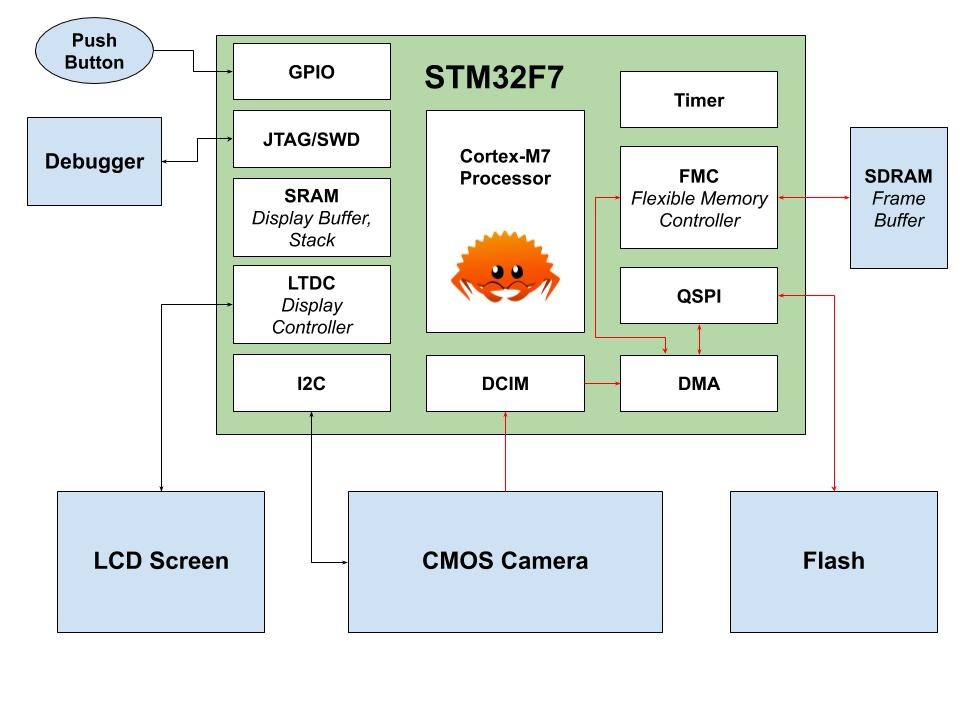
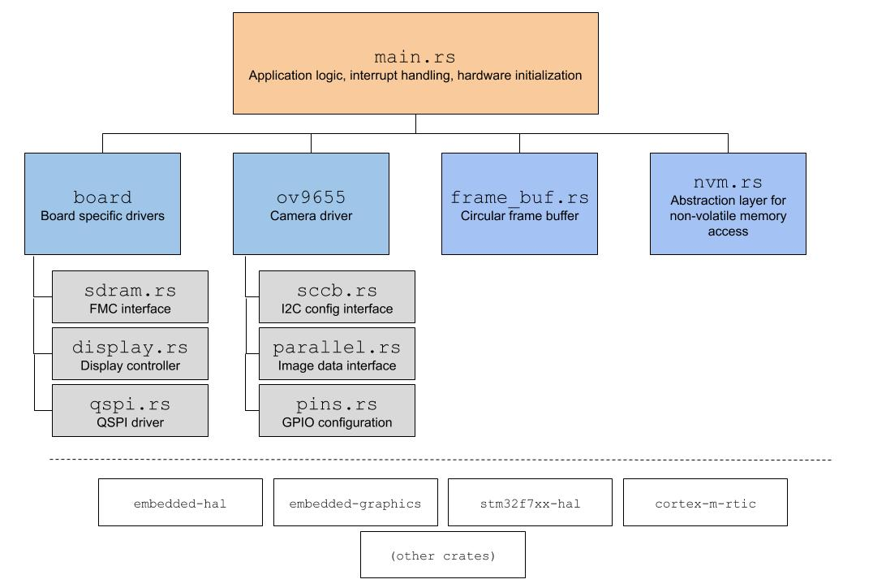

# dashcam-rs

## Overview
This project is a prototype for a car dashboard camera, created to learn more about the Rust programming language and the embedded Rust ecosystem. The prototype implements the basic functionality needed by a car dash cam:
* Capture live video, with a display for preview.
* Buffer past video, ideally several minutes of it.
* Save buffered video to non-volatile memory on user intervention. For example, after a car accident.

## Demo
The STM32F746G Discovery Board is used for the hardware platform with an OV9655 CMOS camera attached. The demo uses QVGA resolution (320x240), 30 fps, and RGB565 color format.

The dash cam buffers as many past frames as possible in SDRAM. On the first button press, the past frames are saved to flash memory. There is a small (~8 second) delay, as write operations for this particular flash device must be done one page (256 bytes) at a time. On the second button press, the saved frames are read from flash into SDRAM and played continuously in a loop.

## Embedded Rust

### Conclusions
Overall, creating this prototype with Rust was much more enjoyable than similar projects I've done with C/C++. Here are the main takeaways:
* __Language__: A lot of ink has been spilled about the benefits of the borrow checker and the ownership model in Rust, but what I enjoyed the most about the language was more minor features like `Option`, `Result<T, E>`, closures, and `match` statements. They made the code cleaner and process of writing code more ergonomic.
* __Ecosystem__: The abstractions built by the embedded Rust community for peripheral access (PACs) are hugely helpful. Being able to set or clear a single bit in a register with a series of zero-cost function calls is very useful in embedded software.
* __Tooling__: The tooling (`cargo`, `probe-rs`, `rust-analyzer`, etc.) is miles ahead of other languages I've used for embedded. Being able to download dependencies, build code, flash the target, and open a debug window in a single command (`cargo embed`) that works _out of the box_ is amazing!
* __Device support__: In the end your choice to use embedded Rust for a project may come down to device support. The STM32 line is well supported by the community, but others may not be. Engagement from device manufacturers will be crucial in making Rust grow in embedded.

### Community
This project relies heavily on a lot of great open-source software created by the embedded Rust community, including:
* [RTIC](https://github.com/rtic-rs/cortex-m-rtic/): A small concurrency framework for Cortex-M processors. Sort of like a mini-RTOS.
* [cortex-m](https://github.com/rust-embedded/cortex-m) and [cortex-m-rt](https://github.com/rust-embedded/cortex-m-rt): Low-level device support for Cortex-M processors.
* [stm32f7xx-hal](https://github.com/stm32-rs/stm32f7xx-hal): Hardware abstraction layer (peripheral drivers) for the STM32F7 part family.
* [embedded-hal](https://github.com/rust-embedded/embedded-hal): Hardware abstraction layer traits for common peripherals.
* [embedded-graphics](https://github.com/embedded-graphics/embedded-graphics): 2D graphics library for embedded devices.

Hopefully, this project adds the following contributions to the embedded Rust community:
* [OV9655 CMOS camera device driver](src/ov9655)
    * Abstract SCCB driver for camera setting configuration using `embedded-hal`.
    * Parallel interface driver for the STM32F7 using DCIM and DMA, including live video capture with ping-pong DMA.
* [QSPI flash driver](src/board/qspi.rs)
    * A HAL driver for the QSPI peripheral on the STM32F7. Supports indirect mode with polling or DMA.
        * TODO: Upstream this code to `stm32f7xx-hal`.
    * Device driver for the MT25QL128ABA flash memory chip.

## Project Details

### Hardware Architecture
The primary image data path is outlined in red.

### Software Architecture

### Limitations and Next Steps

#### Memory
The biggest limitation with this prototype is the amount of memory, both volatile and non-volatile. The SDRAM chip used for frame buffering is 8 MB and the QSPI flash chip for saving frames is 16 MB. As a result, it can only buffer several seconds of video. With QVGA resolution (320x240), RGB565 color format, and 30 fps, somewhere between 275 MB - 1.3 GB of RAM is needed to buffer a few minutes of video. For non-volatile memory (flash), probably at least 2x to 10x of the RAM size is desired to store multiple clips during a drive. To increase both memories, a new hardware platform is needed. Since the SDRAM chip is connected via a high-speed interface, a custom PCB would be needed.

There are a couple other ways to resolve this problem:
* Reduce resolution and frame rate.
    * This is not very desirable since resolution is already quite low.
    * The OV9655 only supports 15 or 30 fps, so manual downsampling may be required.
* Change the buffering methodology.
    * Buffer only a few seconds, then write to flash/non-volatile memory continuously. Saving a video is simply updating metadata and files in non-volatile memory.
    * Writing to the current flash memory device is very slow, so a different one may be needed.
    * This would be more work software and more application logic. Overall this solution is not as elegant as the current implementation.

#### Filesystem
Currently non-volatile memory is accessed using raw data and addresses. To support saving and organizing multiple video clips, a filesystem is most likely needed. A stable, mature embedded filesystem may not exist in the embedded Rust ecosystem, so this may be a case for migrating to an embedded Linux platform rather than bare-metal.
